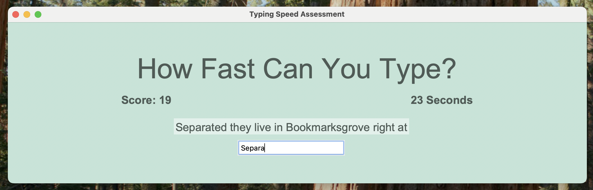
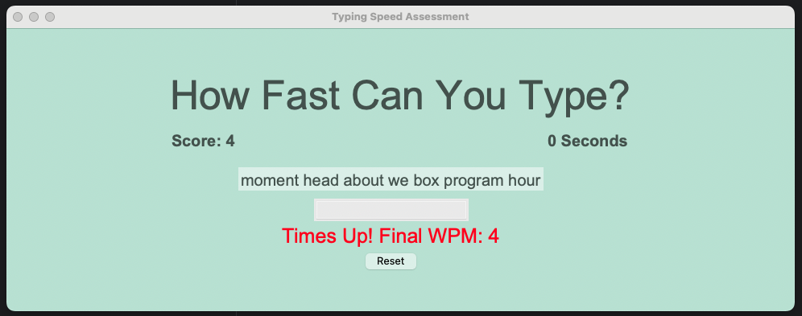

# Day 86: Typing Test

Created a TKinter desktop app that gets 200 words from the `Faker` library. As soon as the user starts to type, a 60 second timer starts and the user must try to type as many words as they can correctly. 

Once 60 seconds is over, the input box is disabled and the final score is shown to user. User can reset to get a new set of words and start typing again.

## Room for Improvement

Make TKinter look better :D 
