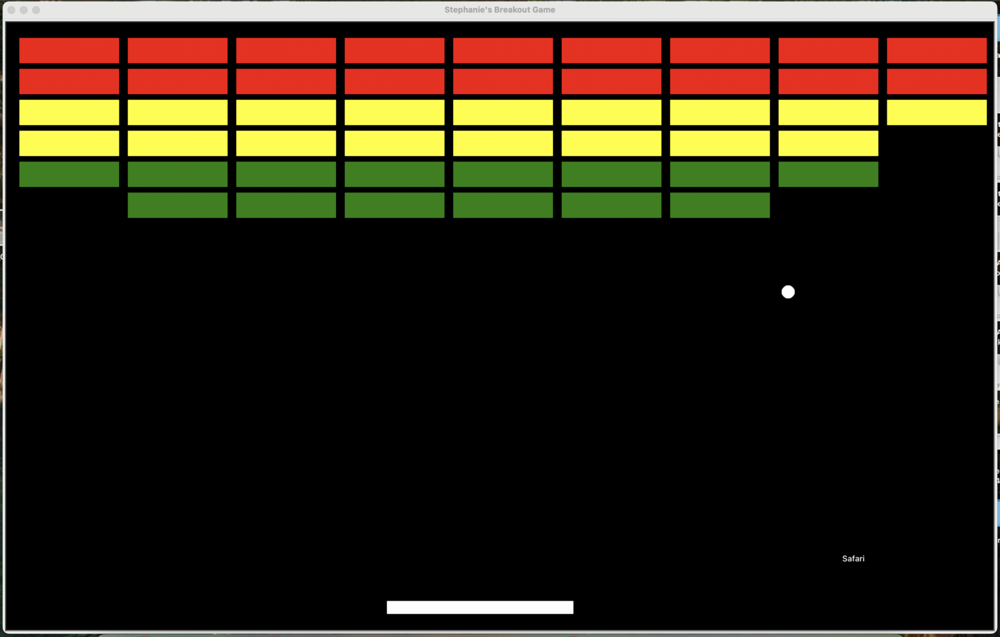

# Day 87: Breakout Game

Create the old school Breakout Game using Turtle library.

Create a class for the `Ball`, `Paddle`, and `Bricks`. Use `Builder` class to create a grid of `Bricks`.

Check coordinates of mouse and move `Paddle` accordingly. Check `Ball` coordinates to see if the ball has hit the wall, ceiling, floor, paddle or bricks.

## TODO: Additional Features

Can improve game by adding a scoreboard and giving user 3 lives. Can also make the ball hitting the bricks more sensitive. Lastly, could improve the fun by changing the angle of the ball based upon where on the paddle the user has hit.

But happy enough with it!